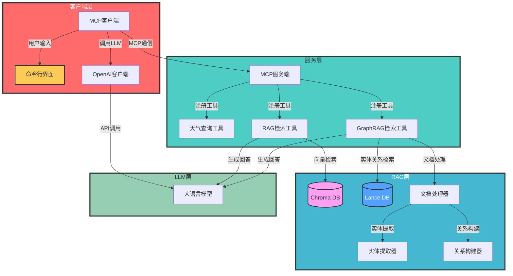
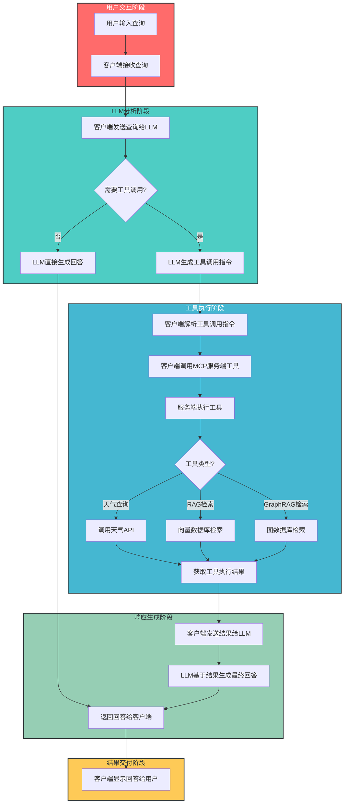
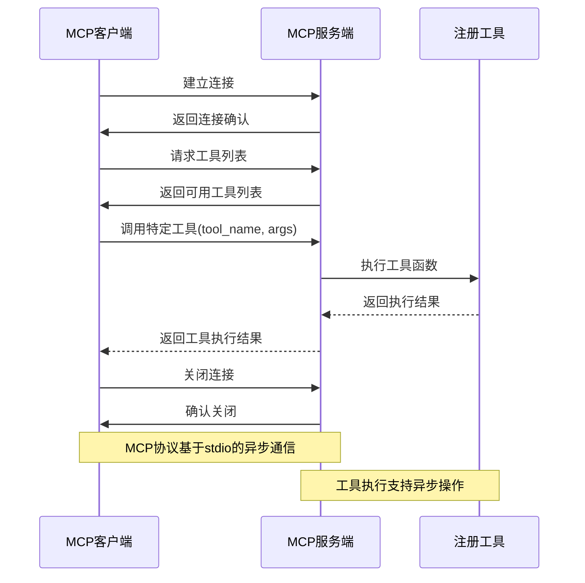
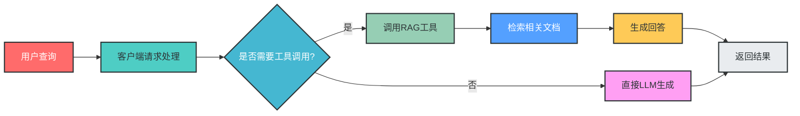
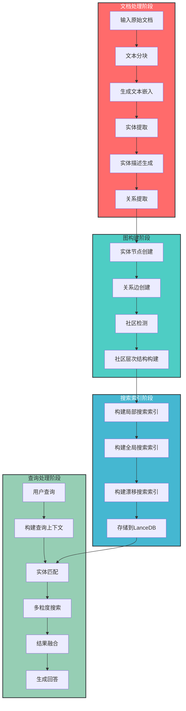

# MCP RAG LLM 项目架构分析

## 1. 概述

MCP RAG LLM 是一个基于模块化通信协议（MCP）的检索增强生成（RAG）系统，集成了传统向量数据库RAG和基于图的RAG（GraphRAG）技术，旨在为大语言模型提供外部知识支持，提高回答的准确性和可靠性。

### 1.1 项目定位

该项目是一个面向开发者的RAG系统开发框架，提供了：
- 模块化的客户端/服务端通信机制
- 灵活的工具注册和调用接口
- 多种RAG实现方式（传统RAG和GraphRAG）
- 与主流大语言模型的无缝集成

### 1.2 项目结构

```
/Users/wangqiao/Downloads/github_project/mcp_rag_llm/
├── .gitignore
├── .vscode/              # VSCode配置文件
├── Readme.md            # 项目主文档
├── data/                # 数据目录
│   └── rag_db/          # RAG数据库
├── docs/                # 文档目录
│   └── README.md        # 架构文档
├── mcp_agent_demo/      # MCP客户端/服务端示例
│   ├── __init__.py
│   ├── client.py        # MCP客户端实现
│   ├── env.example      # 环境变量示例
│   ├── readme.md        # 示例说明
│   ├── run.py           # 运行脚本
│   ├── server.py        # MCP服务端实现
│   └── test.py          # 测试脚本
├── mcp_rag_agent_graphrag_demo/  # GraphRAG示例
│   ├── README.md        # GraphRAG说明
│   ├── __init__.py
│   ├── doupocangqiong/  # 示例文档和处理结果
│   ├── env.example      # 环境变量示例
│   ├── graphrag_client.py  # GraphRAG客户端
│   ├── graphrag_server.py  # GraphRAG服务端
│   └── run.py           # 运行脚本
├── mcp_rag_langchain/   # LangChain RAG实现
│   ├── README.md        # LangChain RAG说明
│   ├── README2.md       # 额外说明
│   ├── db/              # 数据库目录
│   ├── env.example      # 环境变量示例
│   ├── rag_agent.py     # RAG客户端
│   └── rag_server.py    # RAG服务端
├── requirements.txt     # 项目依赖
├── scripts/             # 辅助脚本
│   └── auto_ssh_agent.sh
└── tests/               # 测试目录
    ├── download_bge_large_zh_v15.py    # 下载嵌入模型脚本
    ├── download_bge_reranker_large.py   # 下载重排序模型脚本
    ├── download_chatglm3.py             # 下载ChatGLM3模型脚本
    ├── test_local_model.py              # 本地模型测试脚本
    └── 本地模型加载总结.md              # 本地模型加载总结
```

### 1.3 技术栈

| 技术/框架       | 用途                     | 版本/配置                  |
|-----------------|--------------------------|---------------------------|
| Python          | 主要开发语言             | 3.8+                      |
| LangChain       | RAG框架                  | 最新版本                  |
| GraphRAG        | 图数据库RAG实现          | 最新版本                  |
| MCP             | 模块化通信协议           | 自定义实现                |
| Chroma DB       | 向量数据库               | 最新版本                  |
| LanceDB         | 向量数据库（GraphRAG）   | 最新版本                  |
| OpenAI API      | 大语言模型服务           | 兼容接口（支持阿里通义等）|
| Asyncio         | 异步编程框架             | Python标准库              |

## 2. 模块分析

### 2.1 MCP客户端模块

**功能定位**：与服务端建立连接，处理用户输入并生成响应

**核心组件**：
- `MCPClient`：客户端核心类，管理服务端连接和对话流程
- `ClientSession`：MCP会话管理
- LLM集成：与OpenAI API等大语言模型服务交互

**技术特点**：
- 异步上下文管理
- 自动工具发现和调用
- 集成OpenAI API的函数调用能力
- 完整的会话生命周期管理

**关键实现** (`mcp_agent_demo/client.py`)：

```python
class MCPClient(object):
    def __init__(self):
        self.client = OpenAI(
            api_key=os.environ.get("API_KEY"),
            base_url=os.environ.get("BASE_URL")
        )
        self.model = os.environ.get("MODEL")
    
    async def connect_server(self, server_script_path):
        # 创建并启动服务端连接
        server_params = StdioServerParameters(
            command="python",
            args=[server_script_path],
            env=None
        )
        self.stdio, self.write = await self.exit_stack.enter_async_context(stdio_client(server_params))
        self.session = await self.exit_stack.enter_async_context(ClientSession(self.stdio, self.write))
        await self.session.initialize()
    
    async def process_query(self, query):
        # 处理用户查询，调用服务端工具并生成响应
        messages = [{"role": "user", "content": query}]
        tools_info = await self.session.list_tools()
        
        # 构建工具列表
        available_tools = [{...} for tool in tools_info.tools]
        
        # 调用LLM生成工具调用指令
        response = self.client.chat.completions.create(
            model=self.model,
            messages=messages,
            tools=available_tools
        )
        
        # 执行工具调用并返回结果
        if response.choices[0].finish_reason == "tool_calls":
            tool_call = message.tool_calls[0]
            result = await self.session.call_tool(tool_call.function.name, json.loads(tool_call.function.arguments))
            # ...
```

### 2.2 MCP服务端模块

**功能定位**：提供工具注册和调用接口，处理来自客户端的请求

**核心组件**：
- `FastMCP`：MCP服务端核心类，负责工具注册和请求处理
- 工具函数：通过`@mcp.tool()`装饰器注册的异步函数

**技术特点**：
- 支持异步工具函数注册
- 基于stdio的进程间通信
- 自动生成工具描述和参数 schema

**关键实现** (`mcp_agent_demo/server.py`)：

```python
# 创建MCP服务实例
mcp = FastMCP("weather")

# 注册工具函数
@mcp.tool()
async def query_weather(city: str) -> str:
    """输入指定的城市名(英文)，返回今日天气情况"""
    data = await get_weather(city)
    return await format_data(json_data=data)

# 运行服务
mcp.run(transport="stdio")
```

### 2.3 LangChain RAG系统

**功能定位**：基于向量数据库的传统RAG系统，提供快速的文档检索和问答功能

**核心组件**：
- 文档加载模块：支持多种文档格式加载
- 文本分块模块：将文档分割为适合检索的块
- 向量嵌入模块：使用预训练模型将文本转换为向量
- 向量数据库：存储和检索文本向量
- 问答链：基于检索结果生成回答

**技术特点**：
- 基于LangChain框架实现
- 使用Chroma DB作为向量数据库
- 支持本地和远程嵌入模型
- 提供测试和服务器两种运行模式

**关键实现** (`mcp_rag_langchain/rag_server.py`)：

```python
# 优先从环境变量获取本地模型路径，否则使用默认本地路径
embed_model_path = os.getenv("EMBED_MODEL_PATH", "e:/github_project/models/bge-large-zh-v1.5")
self.embedding = HuggingFaceEmbeddings(
    model_name=embed_model_path,
    model_kwargs={'device': 'cpu'},
    encode_kwargs={'normalize_embeddings': True}
)
```

### 2.4 GraphRAG模块

**功能定位**：基于图数据库的增强型RAG系统，提供更丰富的语义关系和上下文理解

**核心组件**：
- 实体提取模块：从文档中提取实体信息
- 关系构建模块：构建实体间的关系网络
- 社区检测模块：识别实体社区和层次结构
- 多粒度搜索模块：支持本地搜索、全局搜索和漂移搜索

**目录结构** (`mcp_rag_agent_graphrag_demo/doupocangqiong/`)：

```
doupocangqiong/
├── input/          # 原始文档输入
├── cache/          # 中间结果缓存
│   ├── entity_extraction/       # 实体提取结果
│   ├── community_reporting/     # 社区报告
│   ├── summarize_descriptions/  # 实体描述摘要
│   └── text_embedding/          # 文本嵌入向量
├── output/         # 最终输出
│   ├── lancedb/    # LanceDB向量数据库
│   └── *.parquet   # 处理结果文件
├── prompts/        # LLM提示模板
└── settings.yaml   # 配置文件
```

**技术特点**：
- 基于LanceDB的高效向量存储和检索
- 多阶段文档处理流水线
- 实体和关系的自动提取和构建
- 社区检测和层次结构分析

## 3. 交互关系

### 3.1 系统架构图



### 3.2 核心交互流程

**用户查询处理流程**：



### 3.3 MCP通信协议流程



## 4. 核心流程分析

### 4.1 RAG查询处理流程



### 4.2 GraphRAG搜索流程


### 4.3 GraphRAG文档处理流程



## 5. 技术实现细节

### 5.1 异步编程模型

项目广泛使用Python的asyncio库实现异步编程，主要应用在以下场景：

- **HTTP请求处理**：使用httpx.AsyncClient实现异步HTTP请求
- **客户端/服务端通信**：基于stdio的异步通信机制
- **工具函数执行**：支持异步工具函数的注册和调用
- **会话管理**：异步上下文管理器确保资源正确释放

**关键代码示例**：

```python
# 异步HTTP请求
async def get_weather(city: str) -> dict[str, Any]:
    async with httpx.AsyncClient() as client:
        try:
            response = await client.get(url, params=parameter)
            return response.json()
        except Exception as err:
            return {"error": f"请求失败: {str(err)}"}

# 异步工具注册
@mcp.tool()
async def query_weather(city: str) -> str:
    data = await get_weather(city)
    return await format_data(json_data=data)
```

### 5.2 配置管理

项目使用dotenv库从.env文件加载配置信息，主要包括：

- 大语言模型API配置（API_KEY、BASE_URL、MODEL）
- 嵌入模型配置（EMBED_MODEL）
- 外部服务API配置（WEATHER_API_URL、WEATHER_API_KEY）

**关键代码示例**：

```python
from dotenv import load_dotenv
load_dotenv()

# 加载API配置
self.client = OpenAI(
    api_key=os.environ.get("API_KEY"),
    base_url=os.environ.get("BASE_URL")
)
```

### 5.3 错误处理

项目实现了完整的错误处理机制，包括：

- API请求错误处理
- 工具调用错误处理
- 会话管理错误处理
- 异常信息格式化

**关键代码示例**：

```python
async def get_weather(city: str) -> dict[str, Any]:
    try:
        response = await client.get(url, params=parameter)
        return response.json()
    except Exception as err:
        return {"error": f"请求失败: {str(err)}"}
```

## 6. 功能特性

### 6.1 多RAG实现支持

项目支持多种RAG实现方式：

| RAG类型 | 实现方式 | 适用场景 | 优势 |
|---------|----------|----------|------|
| 传统RAG | LangChain + Chroma DB | 简单文档查询 | 实现简单，性能高效 |
| GraphRAG | 自定义实现 + LanceDB | 复杂关系查询 | 支持实体关系分析，上下文理解更深入 |

### 6.2 模块化设计

采用MCP协议实现模块化通信，便于扩展和维护：
- 客户端和服务端解耦
- 工具可独立注册和调用
- 支持多种服务端实现

### 6.3 异步编程支持

广泛使用asyncio实现异步编程：
- 提高系统吞吐量
- 支持并发请求处理
- 优化I/O密集型操作

### 6.4 多模型兼容

支持多种大语言模型API：
- OpenAI API
- 阿里通义
- Ollama本地模型

## 7. 代码示例

### 7.1 运行LangChain RAG

```python
# 启动RAG服务器
python mcp_rag_langchain/rag_server.py

# 运行RAG客户端
python mcp_rag_langchain/rag_agent.py --server_script mcp_rag_langchain/rag_server.py
```

### 7.2 运行GraphRAG

```python
# 启动GraphRAG服务器
python mcp_rag_agent_graphrag_demo/graphrag_server.py

# 运行GraphRAG客户端
python mcp_rag_agent_graphrag_demo/graphrag_client.py mcp_rag_agent_graphrag_demo/graphrag_server.py
```

### 7.3 测试RAG查询

```python
# 运行RAG测试查询
python mcp_rag_langchain/rag_server.py --mode test --query "萧炎的女性朋友有那些?"
```

## 8. 总结

### 8.1 架构优势

1. **模块化设计**：基于MCP协议的模块化设计，便于扩展和维护
2. **多RAG支持**：同时支持传统RAG和GraphRAG，满足不同场景需求
3. **异步处理**：采用asyncio实现高效的异步处理，提高系统性能
4. **多模型兼容**：支持多种大语言模型API，灵活性强
5. **可扩展性**：易于添加新的工具和服务

### 8.2 应用场景

1. **知识库问答**：基于文档的智能问答系统
2. **复杂关系查询**：利用GraphRAG进行实体关系分析
3. **多模态知识整合**：支持多种文档格式和数据源
4. **个性化对话系统**：结合用户历史和知识库提供个性化回答

### 8.3 技术亮点

1. **MCP通信协议**：自定义的模块化通信协议，实现了高效的客户端/服务端通信
2. **异步工具调用**：支持异步工具函数的注册和调用，提高了系统的并发处理能力
3. **GraphRAG实现**：完整的基于图数据库的RAG系统，提供了丰富的实体和关系分析能力
4. **与LLM的深度集成**：充分利用OpenAI API的函数调用能力，实现了工具的自动发现和调用

### 8.4 改进建议

1. **错误处理增强**：增加更完善的错误处理和重试机制
2. **性能优化**：
   - 优化向量检索算法
   - 增加缓存机制，减少重复计算
   - 实现批处理功能，提高处理大量文档的效率
3. **监控与日志**：
   - 添加更全面的监控指标
   - 实现结构化日志，便于问题诊断和性能分析
4. **安全增强**：
   - 增加认证和授权机制
   - 实现数据加密传输
   - 敏感信息保护
5. **用户界面**：开发可视化用户界面，提高易用性
6. **测试覆盖**：增加单元测试和集成测试，提高代码质量和系统稳定性

---

**文档生成时间**：2025年12月
**文档版本**：3.0
**分析范围**：`/Users/wangqiao/Downloads/github_project/mcp_rag_llm/` 及相关模块