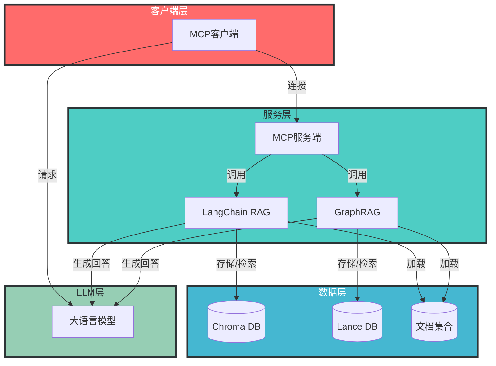
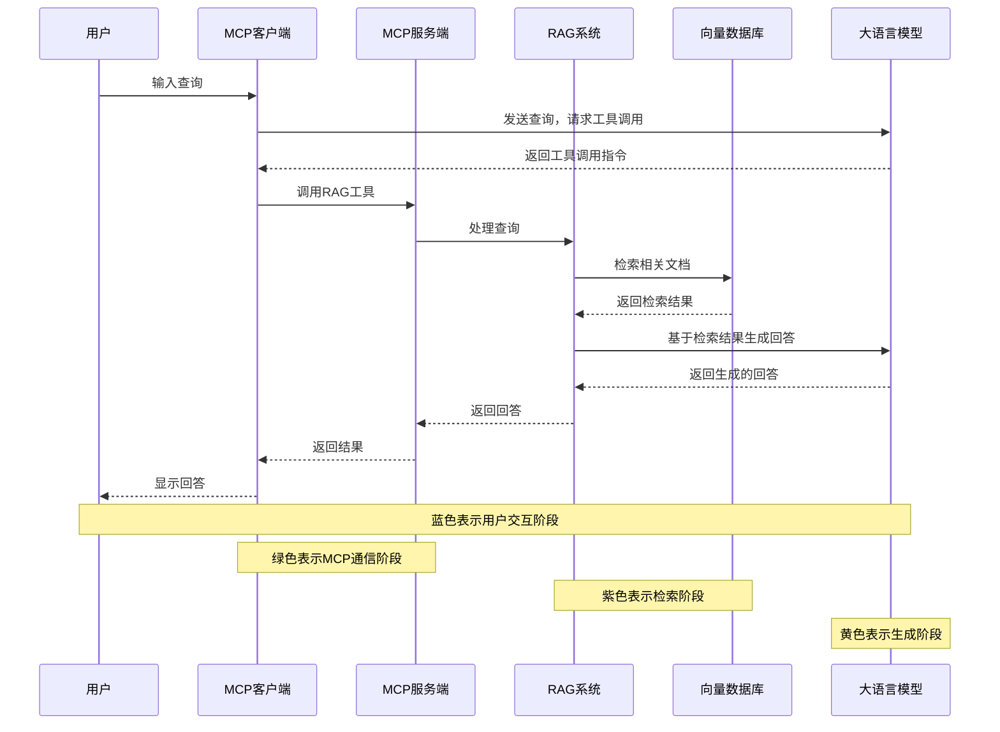
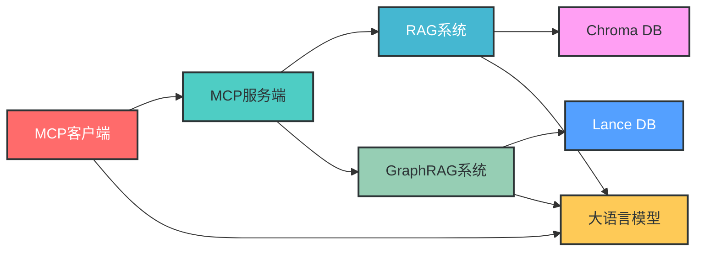
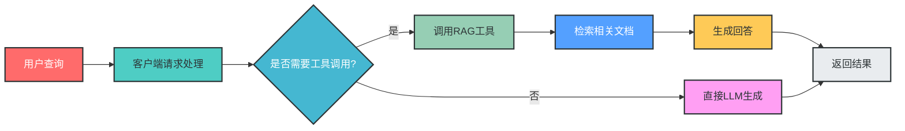

# MCP RAG LLM 项目架构分析

## 1. 概述

MCP RAG LLM 是一个基于模块化通信协议（MCP）的检索增强生成（RAG）系统，集成了多种RAG实现方式，包括传统的基于向量数据库的RAG和基于图的RAG（GraphRAG）。项目旨在为大语言模型提供外部知识支持，提高回答的准确性和可靠性。

### 1.1 项目结构


### 1.2 技术栈

| 技术/框架       | 用途                     | 版本/配置                  |
|-----------------|--------------------------|---------------------------|
| Python          | 主要开发语言             | 3.8+                      |
| LangChain       | RAG框架                  | 最新版本                  |
| GraphRAG        | 图数据库RAG实现          | 最新版本                  |
| MCP             | 模块化通信协议           | 自定义实现                |
| Chroma DB       | 向量数据库               | 最新版本                  |
| LanceDB         | 向量数据库（GraphRAG）   | 最新版本                  |
| OpenAI API      | 大语言模型服务           | 兼容接口（支持阿里通义等）|
| Asyncio         | 异步编程框架             | Python标准库              |

## 2. 模块分析

### 2.1 MCP客户端模块


### 2.2 MCP服务端模块


### 2.3 LangChain RAG系统


### 2.4 GraphRAG系统


## 3. 交互关系

### 3.1 系统架构图



### 3.2 数据流程图



### 3.3 模块依赖关系



## 4. 核心流程分析

### 4.1 RAG查询处理流程



### 4.2 GraphRAG搜索流程


## 5. 功能特性

### 5.1 多RAG实现支持

项目支持多种RAG实现方式：

| RAG类型 | 实现方式 | 适用场景 | 优势 |
|---------|----------|----------|------|
| 传统RAG | LangChain + Chroma DB | 简单文档查询 | 实现简单，性能高效 |
| GraphRAG | 自定义实现 + LanceDB | 复杂关系查询 | 支持实体关系分析，上下文理解更深入 |

### 5.2 模块化设计

采用MCP协议实现模块化通信，便于扩展和维护：
- 客户端和服务端解耦
- 工具可独立注册和调用
- 支持多种服务端实现

### 5.3 异步编程支持

广泛使用asyncio实现异步编程：
- 提高系统吞吐量
- 支持并发请求处理
- 优化I/O密集型操作

### 5.4 多模型兼容

支持多种大语言模型API：
- OpenAI API
- 阿里通义
- Ollama本地模型

## 6. 总结

### 6.1 架构优势

1. **模块化设计**：基于MCP协议的模块化设计，便于扩展和维护
2. **多RAG支持**：同时支持传统RAG和GraphRAG，满足不同场景需求
3. **异步处理**：采用asyncio实现高效的异步处理，提高系统性能
4. **多模型兼容**：支持多种大语言模型API，灵活性强
5. **可扩展性**：易于添加新的工具和服务

### 6.2 应用场景

1. **知识库问答**：基于文档的智能问答系统
2. **复杂关系查询**：利用GraphRAG进行实体关系分析
3. **多模态知识整合**：支持多种文档格式和数据源
4. **个性化对话系统**：结合用户历史和知识库提供个性化回答

### 6.3 改进建议

1. **错误处理增强**：增加更完善的错误处理和重试机制
2. **性能优化**：优化向量检索和LLM调用的性能
3. **监控与日志**：添加更全面的监控和日志系统
4. **安全增强**：增加认证和授权机制
5. **用户界面**：开发可视化用户界面，提高易用性

## 7. 代码示例

### 7.1 运行LangChain RAG

```python
# 启动RAG服务器
python mcp_rag_langchain/rag_server.py

# 运行RAG客户端
python mcp_rag_langchain/rag_agent.py --server_script mcp_rag_langchain/rag_server.py
```

### 7.2 运行GraphRAG

```python
# 启动GraphRAG服务器
python mcp_rag_agent_graphrag/mcp_graphrag/graphrag_server.py

# 运行GraphRAG客户端
python mcp_rag_agent_graphrag/mcp_graphrag/graphrag_client.py mcp_rag_agent_graphrag/mcp_graphrag/graphrag_server.py
```

---

**文档生成时间**：2024年12月
**文档版本**：1.0
**作者**：AI编程助手