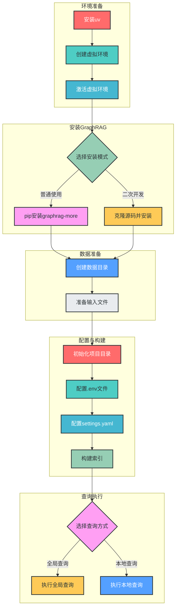

# GraphRAG索引构建指南：基于uv虚拟环境

## 一、概述

GraphRAG（Graph Retrieval-Augmented Generation）是一种结合知识图谱与检索增强生成的高级RAG技术，能够构建结构化知识索引并支持高效的语义查询。本指南将详细介绍如何使用`uv`虚拟环境管理工具快速搭建GraphRAG环境并完成索引构建，全程无需依赖Poetry，步骤更轻量化且兼容性良好（支持Python 3.10-3.12）。

## 二、环境准备

### 1. 安装uv

#### macOS/Linux
```bash
curl -LsSf https://astral.sh/uv/install.sh | sh
```

#### Windows (PowerShell)
```powershell
powershell -c "irm https://astral.sh/uv/install.ps1 | iex"
```

### 2. 创建并激活虚拟环境

```bash
# 创建虚拟环境（指定Python 3.11）
uv venv .venv --python=3.11

cOS/Linux
source .venv/bin/activate

# Windows (Cmd)
.venv\Scripts\activate.bat

# Windows (PowerShell)
.venv\Scripts\Activate.ps1
```

> **注意**：激活后终端会显示`(.venv)`前缀，后续所有命令需在激活状态下执行。

## 三、安装GraphRAG More

### 场景1：普通使用（推荐）
```bash
uv pip install graphrag-more --index-url=https://mirrors.aliyun.com/pypi/simple/

# 若使用百度千帆，额外安装SDK
pip install qianfan
```

### 场景2：二次开发/调试
```bash
# 克隆源码库
git clone https://github.com/guoyao/graphrag-more.git
cd graphrag-more

# 可编辑模式安装
pip install -e .

# 验证安装
pip list | grep graphrag-more
```

## 四、索引构建流程



### 1. 准备数据

```bash
# 创建数据目录结构
mkdir -p ./ragtest/input

# 下载示例数据（二选一）
# Linux/macOS
curl https://raw.githubusercontent.com/guoyao/graphrag-more/refs/heads/main/examples/resources/pg24022.txt > ./ragtest/input/book.txt

# Windows (PowerShell)
curl -UseBasicParsing https://raw.githubusercontent.com/guoyao/graphrag-more/refs/heads/main/examples/resources/pg24022.txt > ./ragtest/input/book.txt
```

### 2. 初始化项目目录

```bash
graphrag init --root ./ragtest
```

执行后会在`./ragtest`生成：
- `.env`：环境变量配置文件
- `settings.yaml`：核心配置文件

### 3. 配置文件

#### 3.1 配置.env文件

编辑`./ragtest/.env`，设置API密钥：

```bash
# 通用：GraphRAG API密钥
GRAPHRAG_API_KEY=你的模型API密钥

# 百度千帆额外配置（可选）
QIANFAN_ACCESS_KEY=你的千帆AK
QIANFAN_SECRET_KEY=你的千帆SK
```

> **说明**：
> - 阿里通义/字节豆包：仅需配置`GRAPHRAG_API_KEY`
> - Ollama：无需配置API密钥（.env可留空）

#### 3.2 配置settings.yaml

根据使用的模型下载或修改配置文件：

```bash
# 示例：使用百度千帆配置
curl https://raw.githubusercontent.com/guoyao/graphrag-more/refs/heads/main/example_settings/qianfan/settings.yaml > ./ragtest/settings.yaml

# 其他模型配置
# 阿里通义：tongyi/settings.yaml
# 字节豆包：doubao/settings.yaml
# Ollama：ollama/settings.yaml
```

**关键配置项**：

- **百度千帆**：确认`model`为`ernie-speed-pro-128k`/`tao-8k`
- **字节豆包**：替换`model`为「推理接入点ID」
- **Ollama**：
  ```bash
  # 先安装Ollama并下载模型
  ollama pull mistral:latest
  ollama pull quentinz/bge-large-zh-v1.5:latest
  ```
  确认`api_base`为`http://localhost:11434/v1`

### 4. 构建索引

```bash
graphrag index --root ./ragtest
```

> **限速处理**：若触发限速，可修改`settings.yaml`中的参数：
> ```yaml
> requests_per_minute: 10
> concurrent_requests: 1
> ```

## 五、查询执行

### 全局查询

```bash
graphrag query --root ./ragtest --method global --query "What are the top themes in this story?"
```

### 本地查询

```bash
graphrag query --root ./ragtest --method local --query "Who is Scrooge, and what are his main relationships?"
```

## 六、关键注意事项

1. **始终激活虚拟环境**：所有`graphrag`命令需在`.venv`激活状态下执行
2. **uv与Poetry对比**：uv更轻量，无需处理`pyproject.toml`/`poetry.lock`
3. **Ollama环境要求**：需先启动Ollama服务并下载所需模型
4. **版本兼容**：GraphRAG More 1.1.0+的`settings.yaml`结构与旧版本差异较大

## 七、常见问题解决

1. **JSON解析报错**：
   - 重复执行命令
   - 修改`settings.yaml`中的`llm.model`，换用更兼容的模型

2. **依赖冲突**：
   - 删除现有虚拟环境，重新创建
   ```bash
   rm -rf .venv  # macOS/Linux
   # rmdir /s .venv  # Windows
   uv venv .venv --python=3.11
   ```

3. **命令未找到**：
   - 确认虚拟环境已激活
   - 重新安装graphrag-more

## 八、环境重置

```bash
# 退出虚拟环境
deactivate

# 删除虚拟环境
rm -rf .venv  # macOS/Linux
# rmdir /s .venv  # Windows

# 重新创建虚拟环境
uv venv .venv --python=3.11
```