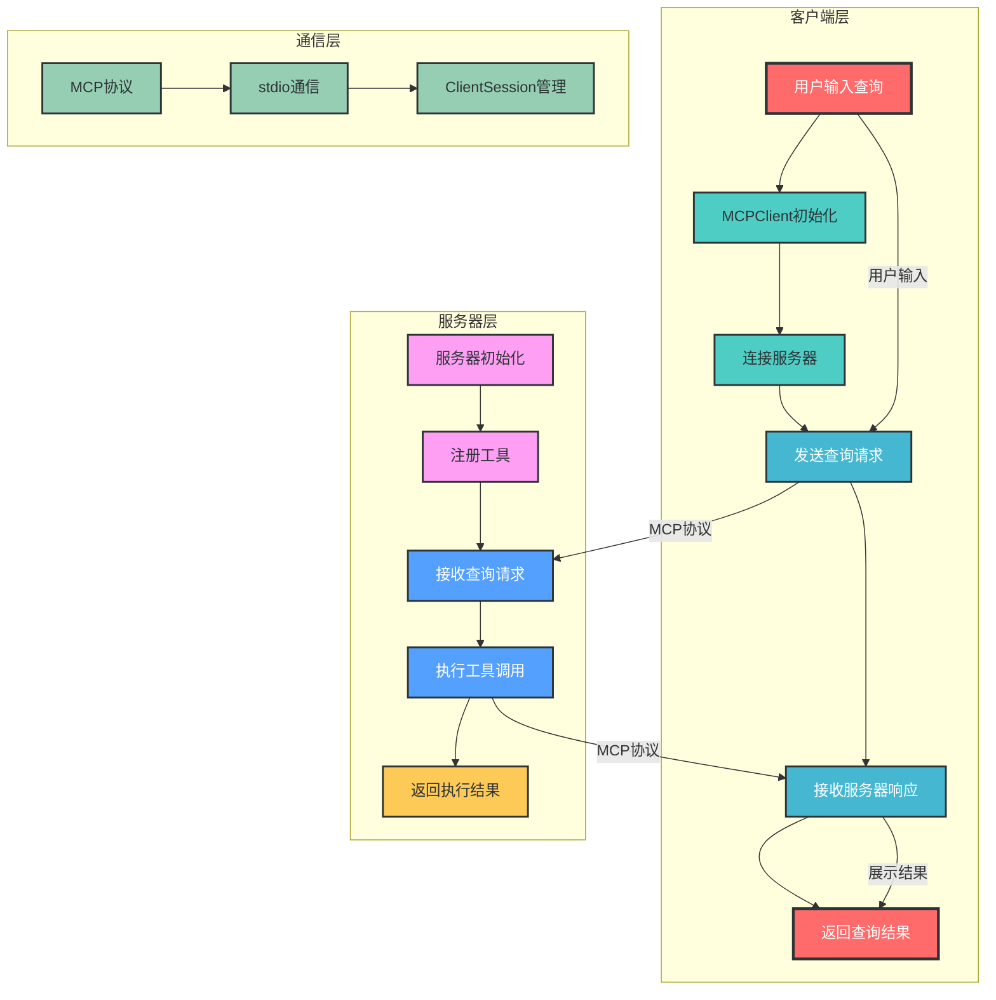
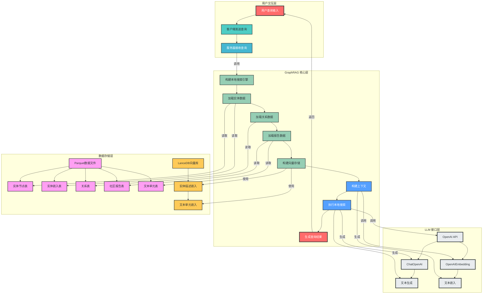

# MCP RAG Agent GraphRAG 系统架构与流程

## 1. 系统概述

`mcp_rag_agent_graphrag` 是一个基于 RAG (Retrieval-Augmented Generation) 和 GraphRAG 技术的智能问答系统，专为处理结构化知识查询而设计。该系统主要包含两个核心模块：

- **mcp_agent**：实现客户端-服务器通信框架
- **mcp_graphrag**：实现基于 GraphRAG 的知识查询功能

## 2. 客户端-服务器交互流程



## 3. GraphRAG 查询流程



## 4. 核心组件说明

### 4.1 mcp_agent 模块

#### 4.1.1 客户端 (client.py)

- **MCPClient 类**：负责客户端初始化、服务器连接、查询处理等核心功能
- **主要方法**：
  - `__init__`：初始化客户端，加载环境变量和 OpenAI 配置
  - `connect_server`：连接到指定的服务器脚本
  - `process_query`：处理用户查询，调用 LLM 和服务器工具
  - `chat`：提供交互式聊天界面

#### 4.1.2 服务器 (server.py)

- **MCP 服务器**：基于 FastMCP 实现的服务器框架
- **工具注册**：注册可用的查询工具，如天气查询、GraphRAG 查询等
- **请求处理**：接收客户端请求，执行相应工具，并返回结果

### 4.2 mcp_graphrag 模块

#### 4.2.1 GraphRAG 客户端 (graphrag_client.py)

- 扩展自 MCPClient，增加了会话管理功能
- 支持与 GraphRAG 服务器的交互

#### 4.2.2 GraphRAG 服务器 (graphrag_server.py)

- **核心功能**：实现基于 GraphRAG 的知识查询
- **主要组件**：
  - 数据加载器：读取 Parquet 格式的实体、关系、报告等数据
  - 向量存储：使用 LanceDB 存储实体和文本嵌入
  - 上下文构建器：构建查询上下文
  - 搜索引擎：实现本地搜索、全局搜索和 DRIFT 搜索

## 5. 数据结构

系统使用以下核心数据结构：

| 表名 | 描述 |
|------|------|
| create_final_nodes | 实体节点数据 |
| create_final_entities | 实体嵌入数据 |
| create_final_communities | 社区数据 |
| create_final_community_reports | 社区报告数据 |
| create_final_text_units | 文本单元数据 |
| create_final_relationships | 关系数据 |

## 6. 环境配置

系统需要配置以下环境变量：

```
API_KEY=your_openai_api_key
BASE_URL=your_openai_base_url
MODEL=your_llm_model_name
```

## 7. 使用方法

### 7.1 启动 GraphRAG 服务

```bash
# 启动GraphRAG服务器
python -m mcp_rag_agent_graphrag.mcp_graphrag.graphrag_server
```

### 7.2 客户端查询

```bash
# 使用GraphRAG客户端进行查询
python -m mcp_rag_agent_graphrag.mcp_graphrag.graphrag_client mcp_rag_agent_graphrag/mcp_graphrag/graphrag_server.py
```

### 7.3 交互式查询

启动客户端后，可以进行交互式查询：

```
请输入:萧炎的女性朋友有哪些?
结果: 萧炎在小说《斗破苍穹》中有多位女性朋友，包括萧薰儿、彩鳞、小医仙、云韵等。
```

## 8. 技术特点

1. **基于 GraphRAG**：利用图结构知识增强查询能力
2. **MCP 通信协议**：实现高效的客户端-服务器通信
3. **多模态搜索**：支持本地搜索、全局搜索和 DRIFT 搜索
4. **向量存储优化**：使用 LanceDB 提供高效的向量检索
5. **可扩展架构**：模块化设计，易于扩展新功能

## 9. 应用场景

- 结构化知识问答
- 小说/文档内容查询
- 知识图谱构建与查询
- 智能客服与助手

## 10. 测试说明

### 10.1 单元测试

```bash
# 运行单元测试
python -m pytest tests/
```

### 10.2 集成测试

```bash
# 启动服务器
python mcp_rag_agent_graphrag/mcp_graphrag/graphrag_server.py

# 运行客户端测试
python tests/test_graphrag_client.py
```

## 11. 扩展建议

1. **增加多语言支持**：扩展系统支持多种语言的查询
2. **优化向量存储**：考虑使用更高效的向量数据库
3. **增强上下文理解**：改进上下文构建算法
4. **增加可视化界面**：提供 Web 或 GUI 界面
5. **支持更多数据源**：扩展支持多种数据源格式