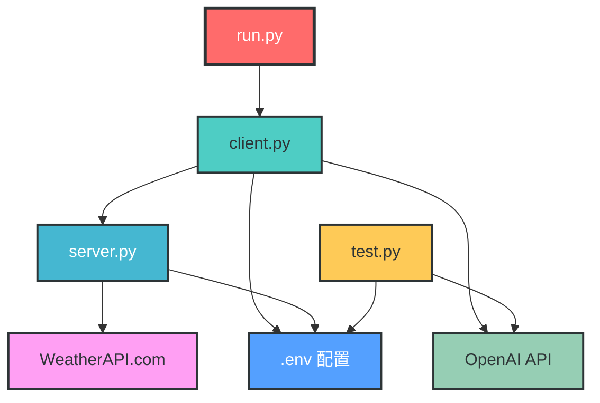
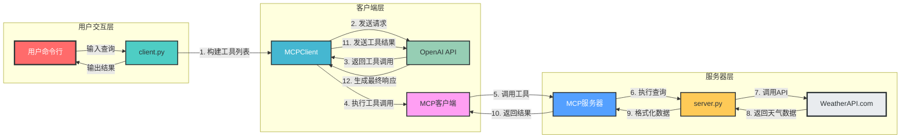
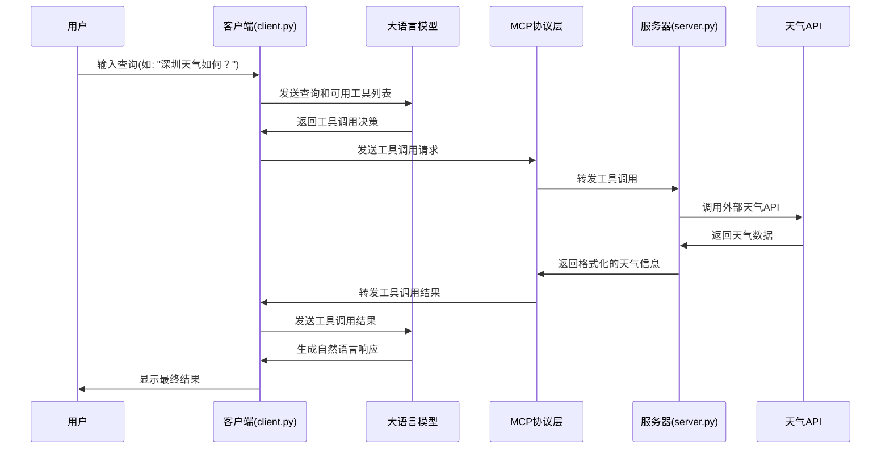

# MCP Agent Demo 项目架构分析

## 1. 项目概述

MCP Agent Demo是一个基于MCP（Model Context Protocol）协议的智能代理系统，主要实现了天气查询功能。该系统采用客户端-服务器架构，通过大语言模型（LLM）驱动工具调用，实现了自然语言到工具执行的无缝转换。

**核心功能**：
- 基于MCP协议的客户端-服务器通信
- 大语言模型驱动的动态工具调用
- 外部Weather API集成
- 异步编程模型

**技术栈**：
- Python 3.x
- MCP协议
- OpenAI API
- WeatherAPI.com
- Asyncio & Httpx
- 命令行交互

## 2. 模块分析

### 2.1 服务器模块 (server.py)

**核心功能**：提供基于MCP协议的天气查询工具服务。

**关键组件**：
- `FastMCP`：MCP服务器实例，用于注册和提供工具
- `get_weather()`：异步调用WeatherAPI获取天气数据
- `format_data()`：格式化天气API响应为友好文本
- `query_weather()`：MCP工具，作为客户端调用的入口

**实现细节**：
```python
@mcp.tool()
async def query_weather(city: str) -> str:
    """
    输入指定的城市名(英文)，返回今日天气情况
    :param city: 城市名称(需使用英文)
    :return: 格式化之后的天气信息
    """
    data = await get_weather(city)
    weather_info = await format_data(json_data=data)
    print("weather_info:", weather_info)
    return weather_info
```

**运行模式**：
- `server`：启动MCP服务器，等待客户端连接
- `test`：直接执行天气查询并显示结果，用于快速测试

### 2.2 客户端模块 (client.py)

**核心功能**：处理用户输入，与LLM交互，调用服务器提供的工具。

**关键组件**：
- `MCPClient`：客户端主类，管理服务器连接和工具调用
- `connect_server()`：连接到MCP服务器
- `process_query()`：处理用户查询，与LLM交互并调用工具
- `chat()`：提供命令行交互界面

**实现细节**：
```python
async def process_query(self, query):
    messages = [{"role": "user", "content": query}]
    tools_info = await self.session.list_tools()
    
    # 构建工具列表
    available_tools = [{"type": "function", "function": {"name": tool.name, "description": tool.description, "input_schema": tool.inputSchema}} for tool in tools_info.tools]
    
    # 与LLM交互
    response = self.client.chat.completions.create(model=self.model, messages=messages, tools=available_tools)
    
    # 处理工具调用
    if response.choices[0].finish_reason == "tool_calls":
        tool_call = message.tool_calls[0]
        tool_name = tool_call.function.name
        tool_args = json.loads(tool_call.function.arguments)
        
        # 调用服务器工具
        result = await self.session.call_tool(tool_name, tool_args)
        
        # 将工具结果返回给LLM
        messages.append(message.model_dump())
        messages.append({"role": "tool", "content": result.content[0].text, "tool_call_id": tool_call.id})
        response = self.client.chat.completions.create(model=self.model, messages=messages)
        return response.choices[0].message.content
```

### 2.3 启动模块 (run.py)

**核心功能**：协调客户端和服务器的启动流程。

**实现细节**：
```python
def main():
    # 构建client.py和server.py的绝对路径
    client_path = os.path.join(script_dir, "client.py")
    server_path = os.path.join(script_dir, "server.py")
    
    # 执行命令: python client.py server.py
    command = [sys.executable, client_path, server_path]
    
    print("正在启动客户端并连接到服务器...")
    subprocess.run(command, check=True)
```

### 2.4 测试模块 (test.py)

**核心功能**：验证LLM连接是否正常工作。

**实现细节**：
```python
completion = client.chat.completions.create(
    model=os.environ.get("MODEL"),
    messages=[
        {'role': 'system', 'content': 'You are a helpful assistant.'},
        {'role': 'user', 'content': '你是谁？'}
        ]
)
print(completion.choices[0].message.content)
```

## 3. 交互关系

### 3.1 模块间依赖关系



### 3.2 系统架构图



## 4. 数据流向与控制流程

### 4.1 主要数据流向



### 4.2 工具调用流程


## 5. 系统特性与设计亮点

### 5.1 MCP协议的优势

- **动态工具发现**：客户端可以自动发现服务器提供的所有工具
- **标准化通信**：采用统一的协议格式，便于扩展和集成
- **异步支持**：完全支持异步编程模型，提高系统性能

### 5.2 架构设计亮点

1. **分层架构**：清晰的用户交互层、客户端层和服务器层分离
2. **松耦合设计**：各模块之间通过明确的接口通信，便于维护和扩展
3. **配置驱动**：通过.env文件统一管理配置，便于部署和管理
4. **错误处理**：完善的异常处理机制，提高系统稳定性
5. **测试友好**：提供多种运行模式和测试工具，便于开发和调试

## 6. 总结

MCP Agent Demo是一个基于MCP协议的智能代理系统，通过客户端-服务器架构实现了大语言模型与外部工具的无缝集成。系统的核心价值在于：

1. **自然语言驱动**：用户可以通过自然语言查询天气信息
2. **动态工具调用**：LLM可以根据用户需求动态选择合适的工具
3. **模块化设计**：清晰的模块划分，便于维护和扩展
4. **异步性能**：采用异步编程模型，提高系统响应速度

该项目展示了如何将大语言模型与外部API集成，实现智能代理系统的设计和开发，为构建更复杂的智能应用提供了参考架构。