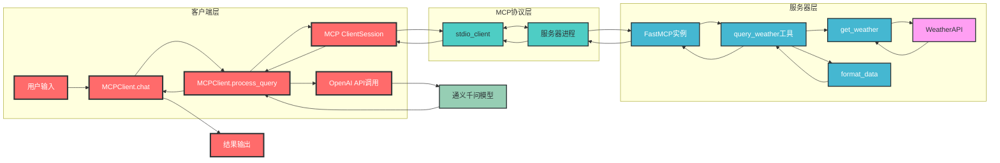
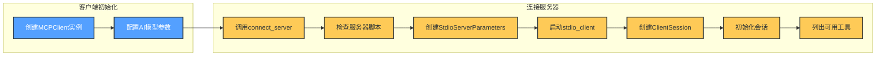
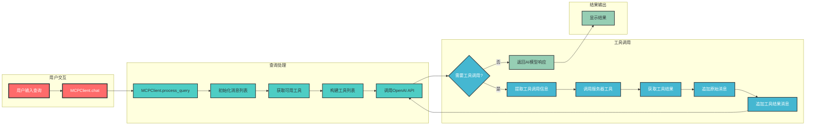

# MCP 服务器客户端架构分析

## 1. 概述

MCP (Model Control Protocol) 是一个用于连接AI模型与工具服务的协议框架，该项目实现了基于MCP的服务器客户端架构，主要用于将AI模型与天气查询服务进行集成。客户端负责与AI模型交互并处理用户查询，服务器端提供具体的工具服务（如天气查询），通过标准输入输出(stdio)进行通信。

## 2. 模块分析

### 2.1 客户端模块 (client.py)

客户端模块是用户与系统交互的入口，负责连接服务器、处理用户查询并与AI模型进行交互。

**核心组件：**

- **MCPClient类**：客户端的核心类，包含以下主要功能：
  - `__init__`：初始化客户端，配置AI模型参数
  - `connect_server`：连接到MCP服务器
  - `process_query`：处理用户查询，调用AI模型和服务器工具
  - `chat`：提供交互式聊天界面
  - `cleanup`：资源清理

**关键依赖：**
- mcp库：提供客户端会话管理和服务器通信功能
- openai库：与通义千问模型进行交互
- asyncio：支持异步编程

### 2.2 服务器模块 (server.py)

服务器模块提供具体的工具服务，供客户端调用。

**核心组件：**

- **FastMCP实例**：创建MCP服务器实例
  ```python
  mcp = FastMCP("weather")
  ```

- **天气查询工具**：
  - `get_weather`：调用WeatherAPI获取天气数据
  - `format_data`：格式化天气数据为可读文本
  - `query_weather`：定义为MCP工具，供客户端调用

**关键依赖：**
- mcp库：提供服务器创建和工具注册功能
- httpx：异步HTTP请求库

### 2.3 测试模块 (test.py)

简单的测试脚本，用于测试通义千问模型的基本功能。

## 3. 交互关系

### 3.1 架构图



### 3.2 核心流程

#### 3.2.1 客户端启动与连接流程



#### 3.2.2 查询处理流程



#### 3.2.3 服务器工具调用流程

```mermaid
flowchart LR
    subgraph MCP服务器
        A[接收工具调用请求] --> B[FastMCP路由]
        B --> C[调用query_weather工具]
    end

    subgraph 天气查询处理
        C --> D[调用get_weather获取天气数据]
        D --> E[构建WeatherAPI请求参数]
        E --> F[发起HTTP异步请求]
        F --> G[WeatherAPI服务]
        G --> H[获取天气JSON数据]
        H --> I[调用format_data格式化数据]
        I --> J[生成可读天气信息]
    end

    subgraph 结果返回
        J --> K[返回工具执行结果]
        K --> L[MCP响应封装]
        L --> M[客户端]
    end

    classDef serverStyle fill:#54A0FF,stroke:#2D3436,stroke-width:2px,color:white;
    classDef weatherStyle fill:#FECA57,stroke:#2D3436,stroke-width:2px,color:#2D3436;
    classDef responseStyle fill:#E9ECEF,stroke:#2D3436,stroke-width:3px,color:#2D3436;

    class A,B,C serverStyle;
    class D,E,F,G,H,I,J weatherStyle;
    class K,L,M responseStyle;
```



## 4. 数据流向

1. **用户输入** → 客户端`chat`方法
2. **用户查询** → 客户端`process_query`方法
3. **查询内容** → 初始化消息列表 → 获取可用工具列表 → 构建工具列表 → 调用OpenAI API
4. **AI模型响应** → 检查是否需要工具调用
5. **需要工具调用** → 提取工具调用信息 → 调用`ClientSession.call_tool` → 通过stdio发送到服务器
6. **服务器接收请求** → FastMCP路由 → 调用`query_weather`工具
7. **工具执行** → 调用`get_weather` → 构建API请求参数 → 发起HTTP异步请求 → 获取WeatherAPI数据 → 调用`format_data`格式化数据
8. **工具结果** → 通过stdio返回给客户端
9. **工具结果处理** → 追加原始消息 → 追加工具结果消息 → 再次调用OpenAI API
10. **最终响应** → 显示给用户
11. **不需要工具调用** → 直接返回AI模型响应 → 显示给用户

## 5. 使用指南

### 5.1 环境配置

1. 确保已安装Python 3.8或更高版本
2. 安装所需依赖：
   ```bash
   pip install openai httpx python-dotenv mcp
   ```
3. 配置`.env`文件中的环境变量：
   ```env
   # 阿里云DashScope API配置
   BASE_URL=https://dashscope.aliyuncs.com/compatible-mode/v1
   API_KEY=sk-xxx  # 替换为你的API Key
   MODEL=qwen-plus  # 使用的模型名称
   
   # 天气API配置
   WEATHER_API_KEY=xxx  # 替换为你的WeatherAPI Key
   WEATHER_API_URL=http://api.weatherapi.com/v1/current.json
   ```

### 5.2 运行步骤

1. 启动客户端并连接到服务器：
   ```bash
   python client.py server.py
   ```

2. 在客户端界面中输入查询：
   ```
   请输入:深圳的天气怎么样？
   ```

3. 查看结果输出：
   ```
   执行的工具名: query_weather, 参数: {'city': 'Shenzhen'}
   结果: 当前城市China.Shenzhen
     温度:27.1，湿度:89，风速:15.8， 天气情况:Moderate or heavy rain with thunder
   ```

## 6. 代码示例

### 6.1 客户端使用示例

```python
# 创建客户端实例
client = MCPClient()

# 连接到服务器
await client.connect_server("server.py")

# 处理用户查询
result = await client.process_query("北京的天气怎么样？")
print(result)

# 清理资源
await client.cleanup()
```

### 6.2 服务器工具扩展示例

```python
# 添加新工具
@mcp.tool()
async def new_tool(param1: str, param2: int) -> str:
    """
    新工具的描述
    :param param1: 参数1描述
    :param param2: 参数2描述
    :return: 工具执行结果
    """
    # 工具实现逻辑
    return f"处理结果: {param1} {param2}"
```

## 7. 常见问题

1. **问题**：客户端连接服务器失败
   **解决方案**：检查服务器脚本路径是否正确，确保服务器脚本是有效的Python文件

2. **问题**：天气查询返回错误
   **解决方案**：检查WeatherAPI Key是否有效，确保城市名称使用英文

3. **问题**：AI模型响应慢
   **解决方案**：检查网络连接，或尝试使用其他模型

## 8. 总结

该项目实现了一个基于MCP的服务器客户端架构，主要特点包括：

1. **模块化设计**：客户端与服务器分离，通过MCP协议进行通信
2. **异步编程**：使用asyncio实现异步通信和处理
3. **工具扩展**：服务器端可以轻松扩展更多工具服务
4. **AI模型集成**：支持与大语言模型（如通义千问）进行集成
5. **stdio通信**：使用标准输入输出作为传输方式，提高通信效率

该架构为AI模型与工具服务的集成提供了一种灵活的解决方案，使得AI模型能够利用外部工具获取实时数据，增强了AI模型的实用性和扩展性。通过简单的配置和扩展，可以快速将AI模型与各种外部服务进行集成，实现更丰富的功能。