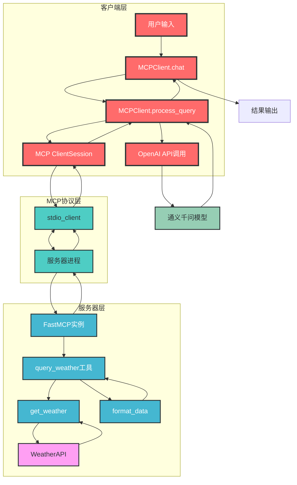
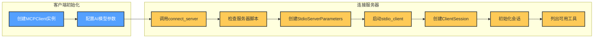
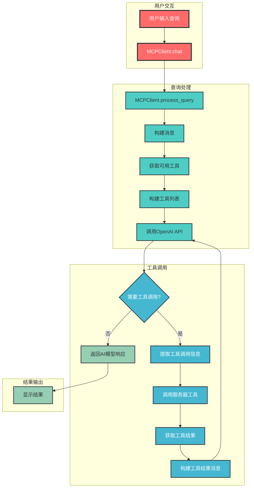
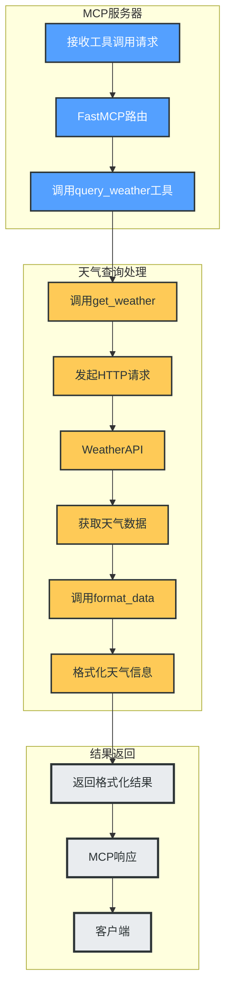

# MCP 服务器客户端架构分析

## 1. 概述

MCP (Model Control Protocol) 是一个用于连接AI模型与工具服务的协议框架，该项目实现了基于MCP的服务器客户端架构，主要用于将AI模型与天气查询服务进行集成。客户端负责与AI模型交互并处理用户查询，服务器端提供具体的工具服务（如天气查询），通过标准输入输出(stdio)进行通信。

## 2. 模块分析

### 2.1 客户端模块 (client.py)

客户端模块是用户与系统交互的入口，负责连接服务器、处理用户查询并与AI模型进行交互。

**核心组件：**

- **MCPClient类**：客户端的核心类，包含以下主要功能：
  - `__init__`：初始化客户端，配置AI模型参数
  - `connect_server`：连接到MCP服务器
  - `process_query`：处理用户查询，调用AI模型和服务器工具
  - `chat`：提供交互式聊天界面
  - `cleanup`：资源清理

**关键依赖：**
- mcp库：提供客户端会话管理和服务器通信功能
- openai库：与通义千问模型进行交互
- asyncio：支持异步编程

### 2.2 服务器模块 (server.py)

服务器模块提供具体的工具服务，供客户端调用。

**核心组件：**

- **FastMCP实例**：创建MCP服务器实例
  ```python
  mcp = FastMCP("weather")
  ```

- **天气查询工具**：
  - `get_weather`：调用WeatherAPI获取天气数据
  - `format_data`：格式化天气数据为可读文本
  - `query_weather`：定义为MCP工具，供客户端调用

**关键依赖：**
- mcp库：提供服务器创建和工具注册功能
- httpx：异步HTTP请求库

### 2.3 测试模块 (test.py)

简单的测试脚本，用于测试通义千问模型的基本功能。

## 3. 交互关系

### 3.1 架构图



### 3.2 核心流程

#### 3.2.1 客户端启动与连接流程



#### 3.2.2 查询处理流程



#### 3.2.3 服务器工具调用流程



## 4. 数据流向

1. **用户输入** → 客户端`chat`方法
2. **用户查询** → 客户端`process_query`方法
3. **查询内容** → 构建消息 → 调用OpenAI API
4. **AI模型响应** → 检查是否需要工具调用
5. **工具调用请求** → MCP ClientSession → 通过stdio发送到服务器
6. **服务器接收请求** → FastMCP路由 → 调用相应工具
7. **工具执行** → 获取外部API数据 → 处理数据
8. **工具结果** → 通过stdio返回给客户端
9. **工具结果** → 构建消息 → 再次调用OpenAI API
10. **最终响应** → 显示给用户

## 5. 总结

该项目实现了一个基于MCP的服务器客户端架构，主要特点包括：

1. **模块化设计**：客户端与服务器分离，通过MCP协议进行通信
2. **异步编程**：使用asyncio实现异步通信和处理
3. **工具扩展**：服务器端可以轻松扩展更多工具服务
4. **AI模型集成**：支持与大语言模型（如通义千问）进行集成
5. **stdio通信**：使用标准输入输出作为传输方式，提高通信效率

该架构为AI模型与工具服务的集成提供了一种灵活的解决方案，使得AI模型能够利用外部工具获取实时数据，增强了AI模型的实用性和扩展性。