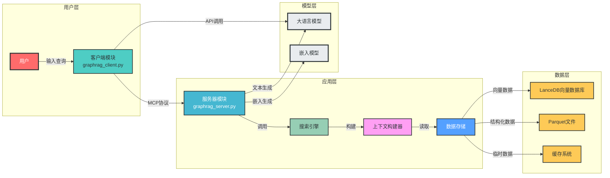
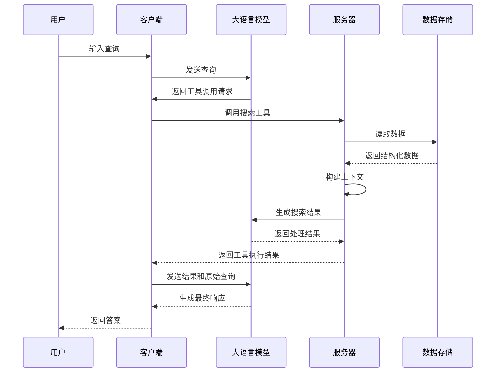

# GraphRAG 智能问答系统架构分析

## 1. 项目概述

本项目是一个基于 GraphRAG（Graph Retrieval-Augmented Generation）技术的智能问答系统，针对《斗破苍穹》小说内容提供知识检索和问答服务。系统采用客户端-服务器架构，通过 MCP（Model Context Protocol）协议实现模块间通信，结合向量数据库和大语言模型提供精准的问答能力。

主要功能：

- 基于小说内容的智能问答
- 实体关系检索与分析
- 多模式搜索能力（本地搜索、全局搜索、DRIFT搜索）
- 与大语言模型集成的自然语言交互

## 2. 模块分析

### 2.1 启动模块 (`run.py`)

**功能**：负责项目的启动和资源协调

**核心代码**：

```python
# 构建客户端和服务器路径
client_path = os.path.join(script_dir, "graphrag_client.py")
server_path = os.path.join(script_dir, "graphrag_server.py")

# 执行启动命令
command = [sys.executable, client_path, server_path]
subprocess.run(command, check=True)

```

**关键特性**：

- 自动检查依赖文件存在性
- 构建绝对路径确保跨平台兼容性
- 处理启动异常和用户中断

### 2.2 客户端模块 (`graphrag_client.py`)

**功能**：提供用户交互界面，处理用户查询并与服务器通信

**核心组件**：

- `MCPClient` 类：管理客户端会话和大语言模型交互
- 连接管理：负责与服务器建立和维护通信
- 查询处理：将用户查询转换为模型可处理的格式
- 工具调用：调用服务器提供的搜索工具

**关键代码**：

```python
async def connect_server(self, server_script_path):
    # 创建服务器启动参数
    server_params = StdioServerParameters(
        command="python",
        args=[server_script_path],
        env=None
    )

    # 启动服务并建立会话
    self.stdio, self.write = await self.exit_stack.enter_async_context(stdio_client(server_params))
    self.session = await self.exit_stack.enter_async_context(ClientSession(self.stdio, self.write))
    await self.session.initialize()

```

### 2.3 服务器模块 (`graphrag_server.py`)

**功能**：提供 GraphRAG 搜索能力，处理客户端请求

**核心组件**：

- 搜索引擎构建器：创建不同类型的搜索引擎
    - 本地搜索 (`build_local_search_engine`)
    - 全局搜索 (`build_global_search_engine`)
    - DRIFT搜索 (`build_drift_search_engine`)
- 上下文构建器：构建搜索所需的上下文信息
- 向量存储：管理实体和文档的向量表示
- MCP 服务：提供工具接口供客户端调用

**关键代码**：

```python
@mcp.tool()
async def local_asearch(query) -> str:
    """为斗破苍穹小说提供相关的知识补充"""
    search_engine = build_local_search_engine()
    result = await search_engine.asearch(query)
    return result.response

```

### 2.4 数据存储模块

**功能**：管理小说内容的结构化数据和向量表示

**核心组件**：

- LanceDB 向量数据库：存储实体和文档的向量表示
- Parquet 文件：存储结构化的实体、关系、社区报告等数据
- 缓存系统：优化搜索性能的中间缓存

**数据结构**：

- 实体表 (`create_final_nodes.parquet`)
- 实体向量表 (`create_final_entities.parquet`)
- 社区表 (`create_final_communities.parquet`)
- 社区报告表 (`create_final_community_reports.parquet`)
- 文本单元表 (`create_final_text_units.parquet`)
- 关系表 (`create_final_relationships.parquet`)

## 3. 交互关系

### 3.1 系统架构图



### 3.2 模块交互流程

1. **启动流程**：
    - `run.py` 启动 `graphrag_client.py`
    - 客户端启动并加载配置
    - 客户端启动 `graphrag_server.py` 作为子进程
    - 客户端与服务器建立 MCP 会话
2. **查询处理流程**：
    - 用户输入查询到客户端
    - 客户端将查询发送给大语言模型
    - 模型决定是否调用工具
    - 如果需要，客户端调用服务器的搜索工具
    - 服务器执行搜索并返回结果
    - 客户端将结果发送给模型生成最终响应
    - 客户端将响应返回给用户

## 4. 数据流向与控制流程

### 4.1 核心数据流向



### 4.2 搜索引擎工作流程

```mermaid
flowchart LR
    subgraph 搜索初始化
        A[接收查询] --> B[构建搜索引擎]
        B --> C[加载上下文构建器]
    end

    subgraph 上下文构建
        C --> D[读取实体数据]
        C --> E[读取关系数据]
        C --> F[读取社区报告]
        C --> G[读取文本单元]
        D --> H[构建实体向量索引]
        E --> I[构建关系图]
        F --> J[构建社区索引]
        G --> K[构建文本单元索引]
        H & I & J & K --> L[合并上下文]
    end

    subgraph 搜索执行
        L --> M[生成查询嵌入]
        M --> N[向量相似度搜索]
        N --> O[过滤相关实体]
        O --> P[检索相关关系]
        P --> Q[提取相关文本]
        Q --> R[生成搜索结果]
    end

    R --> S[返回结果]

    style A fill:#FF6B6B,stroke:#2D3436,stroke-width:2px,color:white
    style B fill:#4ECDC4,stroke:#2D3436,stroke-width:2px,color:#2D3436
    style C fill:#45B7D1,stroke:#2D3436,stroke-width:2px,color:white
    style D fill:#96CEB4,stroke:#2D3436,stroke-width:2px,color:#2D3436
    style E fill:#96CEB4,stroke:#2D3436,stroke-width:2px,color:#2D3436
    style F fill:#96CEB4,stroke:#2D3436,stroke-width:2px,color:#2D3436
    style G fill:#96CEB4,stroke:#2D3436,stroke-width:2px,color:#2D3436
    style H fill:#FF9FF3,stroke:#2D3436,stroke-width:2px,color:#2D3436
    style I fill:#FF9FF3,stroke:#2D3436,stroke-width:2px,color:#2D3436
    style J fill:#FF9FF3,stroke:#2D3436,stroke-width:2px,color:#2D3436
    style K fill:#FF9FF3,stroke:#2D3436,stroke-width:2px,color:#2D3436
    style L fill:#54A0FF,stroke:#2D3436,stroke-width:2px,color:white
    style M fill:#FECA57,stroke:#2D3436,stroke-width:2px,color:#2D3436
    style N fill:#FECA57,stroke:#2D3436,stroke-width:2px,color:#2D3436
    style O fill:#FECA57,stroke:#2D3436,stroke-width:2px,color:#2D3436
    style P fill:#FECA57,stroke:#2D3436,stroke-width:2px,color:#2D3436
    style Q fill:#FECA57,stroke:#2D3436,stroke-width:2px,color:#2D3436
    style R fill:#E9ECEF,stroke:#2D3436,stroke-width:2px,color:#2D3436
    style S fill:#FF6B6B,stroke:#2D3436,stroke-width:2px,color:white

```



## 5. 关键技术与依赖

| 技术/依赖 | 用途 | 来源 |
| --- | --- | --- |
| GraphRAG | 图检索增强生成框架 | `graphrag` 包 |
| LanceDB | 向量数据库 | `lancedb` 包 |
| pandas | 数据处理 | `pandas` 包 |
| tiktoken | 令牌编码 | `tiktoken` 包 |
| MCP | 模块通信协议 | `mcp` 包 |
| OpenAI API | 大语言模型接口 | `openai` 包 |
| dotenv | 环境变量管理 | `python-dotenv` 包 |

## 6. 架构特点与优势

1. **模块化设计**：各模块职责明确，便于维护和扩展
2. **松耦合架构**：通过 MCP 协议实现模块间通信，降低耦合度
3. **多模式搜索**：支持本地搜索、全局搜索和 DRIFT 搜索，满足不同场景需求
4. **向量增强检索**：结合向量数据库和图结构，提高检索准确性
5. **灵活的模型集成**：支持多种大语言模型，便于切换和升级
6. **完善的错误处理**：各层均有异常处理机制，提高系统稳定性

## 7. 总结

本项目采用先进的 GraphRAG 技术构建了一个针对特定领域（《斗破苍穹》小说）的智能问答系统。系统通过客户端-服务器架构实现了用户交互与核心功能的分离，结合向量数据库和大语言模型提供了精准的知识检索和问答能力。

架构设计遵循了模块化、松耦合的原则，便于维护和扩展。多模式搜索能力和灵活的模型集成使得系统能够适应不同的应用场景和需求。

通过对系统架构的深入分析，我们可以看到该项目在知识图谱构建、向量检索、自然语言处理等方面的技术应用，为类似的领域特定问答系统提供了很好的参考架构。