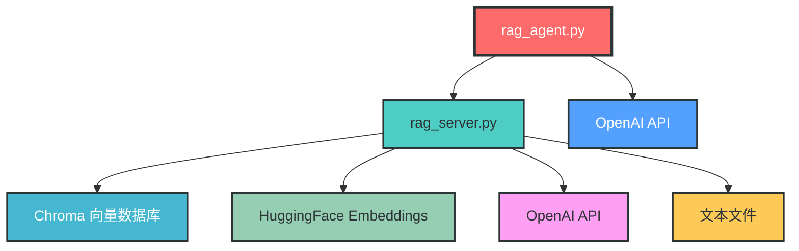
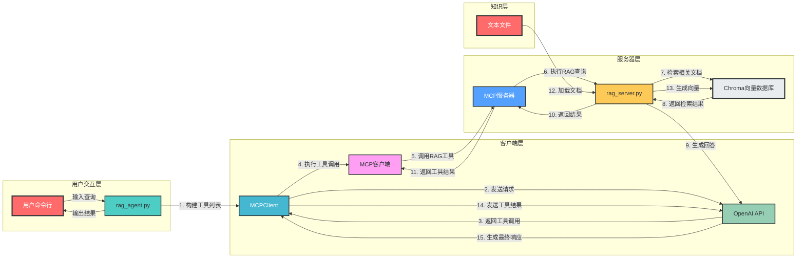
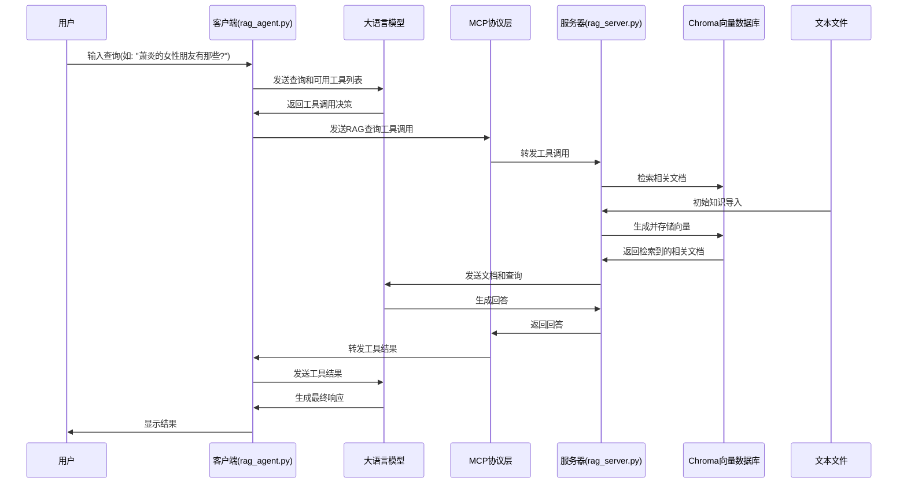
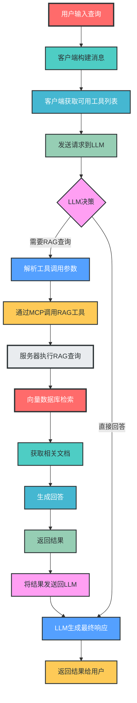

# RAG LangChain 项目架构分析

## 1. 项目概述

RAG LangChain是一个基于检索增强生成（Retrieval-Augmented Generation）技术的智能问答系统，主要针对小说《斗破苍穹》提供相关的知识补充。该系统采用客户端-服务器架构，通过MCP（Model Context Protocol）协议实现通信，并集成了向量数据库和大语言模型（LLM），实现了基于文本内容的智能问答功能。

**核心功能**：
- 基于向量数据库的文档检索
- 大语言模型驱动的问答生成
- 基于MCP协议的客户端-服务器通信
- 支持PDF和文本文件的知识导入
- 异步编程模型

**技术栈**：
- Python 3.x
- LangChain框架
- Chroma向量数据库
- HuggingFace嵌入模型
- OpenAI API
- MCP协议
- Asyncio
- 命令行交互

## 2. 模块分析

### 2.1 服务器模块 (rag_server.py)

**核心功能**：实现基于向量数据库的RAG系统，并通过MCP协议提供查询服务。

**关键组件**：
- `RAGSystem`：RAG系统核心类，封装了向量数据库、检索器和问答链
- `build_knowledge()`：构建知识库，包括文档加载、切分和向量存储
- `query()`：执行RAG查询，检索相关文档并生成回答
- `rag_query()`：MCP工具，作为客户端调用的入口

**实现细节**：
```python
class RAGSystem(object):
    def __init__(self, config):
        self.config = config
        self.llm = ChatOpenAI(...)  # 初始化大语言模型
        self.embedding = HuggingFaceEmbeddings(...)  # 初始化嵌入模型
        self.vectorstore = Chroma(...)  # 初始化向量数据库
        self.retriver = self.vectorstore.as_retriever(...)  # 创建检索器
    
    def build_knowledge(self, file_paths):
        # 1.加载文档
        raw_docs = self._load_documents(file_paths)
        # 2.切分文档-切块
        chunks = self._chunk_documents(docs=raw_docs)
        # 3.生成向量并存储
        self.vectorstore.add_documents(chunks)
        self.vectorstore.persist()
    
    def query(self, question):
        qa_chain = RetrievalQA.from_chain_type(...)
        result = qa_chain.invoke({"query": question})
        return_result = {"answer": result["result"], "sources": [...]}
        return return_result
```

**MCP工具注册**：
```python
@mcp.tool()
async def rag_query(query):
    """为斗破苍穹小说提供相关的知识补充"""
    response = rag.query(query)
    return response["answer"]
```

### 2.2 客户端模块 (rag_agent.py)

**核心功能**：处理用户输入，与LLM交互，调用服务器提供的RAG查询工具。

**关键组件**：
- `MCPClient`：客户端主类，管理服务器连接和工具调用
- `connect_server()`：连接到MCP服务器
- `process_query()`：处理用户查询，与LLM交互并调用工具
- `chat()`：提供命令行交互界面

**实现细节**：
```python
async def process_query(self, query):
    messages = [{"role": "user", "content": query}]
    tools_info = await self.session.list_tools()
    
    # 构建工具列表
    available_tools = [{"type": "function", "function": {...}} for tool in tools_info.tools]
    
    # 与LLM交互
    response = self.client.chat.completions.create(model=self.model, messages=messages, tools=available_tools)
    
    # 处理工具调用
    if response.choices[0].finish_reason == "tool_calls":
        tool_call = message.tool_calls[0]
        tool_name = tool_call.function.name
        tool_args = json.loads(tool_call.function.arguments)
        
        # 调用服务器工具
        result = await self.session.call_tool(tool_name, tool_args)
        
        # 将工具结果返回给LLM
        messages.append(message.model_dump())
        messages.append({"role": "tool", "content": result.content[0].text, "tool_call_id": tool_call.id})
        response = self.client.chat.completions.create(model=self.model, messages=messages)
        return response.choices[0].message.content
```

## 3. 交互关系

### 3.1 模块间依赖关系



### 3.2 系统架构图



## 4. 数据流向与控制流程

### 4.1 主要数据流向



### 4.2 RAG查询流程图



## 5. 系统特性与设计亮点

### 5.1 RAG技术的应用

- **检索增强生成**：结合向量数据库检索和LLM生成，提供基于文本内容的准确回答
- **向量存储**：使用Chroma向量数据库高效存储和检索文档内容
- **文档处理**：支持PDF和文本文件的加载、切分和向量化

### 5.2 架构设计亮点

1. **分层架构**：清晰的用户交互层、客户端层、服务器层和知识层分离
2. **松耦合设计**：各模块之间通过明确的接口通信，便于维护和扩展
3. **MCP协议**：采用标准化协议实现客户端-服务器通信，提高系统互操作性
4. **异步支持**：完全支持异步编程模型，提高系统性能
5. **可配置性**：支持模型选择、检索参数、文档切分等多种配置选项

## 6. 总结

RAG LangChain是一个基于检索增强生成技术的智能问答系统，通过MCP协议实现客户端-服务器架构，集成了向量数据库和大语言模型，为小说《斗破苍穹》提供智能问答服务。

**系统的核心价值**：
1. **知识增强**：通过向量数据库实现基于文本内容的知识检索，增强LLM的回答准确性
2. **自然语言交互**：用户可以通过自然语言查询获取相关知识
3. **可扩展性**：模块化设计便于扩展到其他文本内容和应用场景
4. **易用性**：提供简单的命令行界面，便于用户使用和测试

该项目展示了如何将LangChain、向量数据库和MCP协议结合起来，构建一个完整的RAG系统，为构建更复杂的智能应用提供了参考架构。