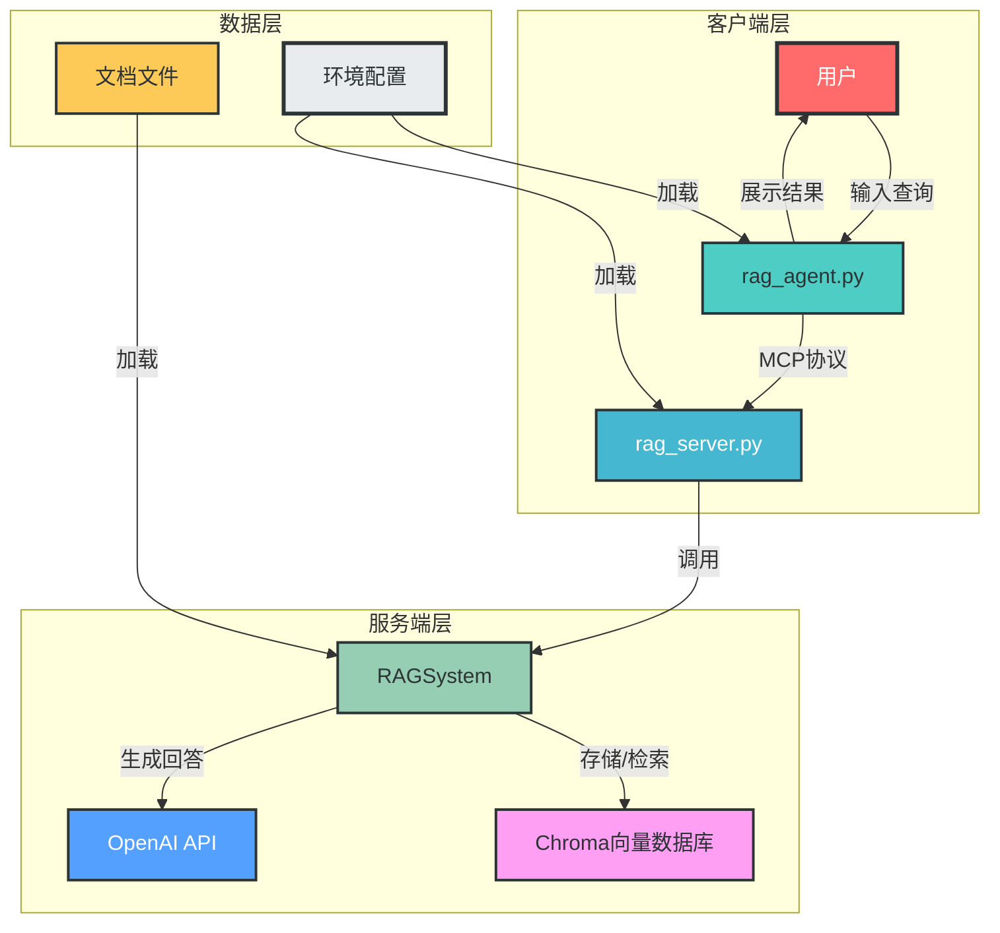
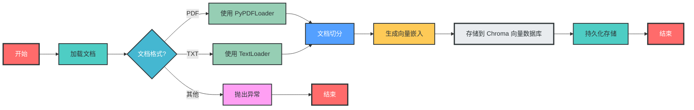
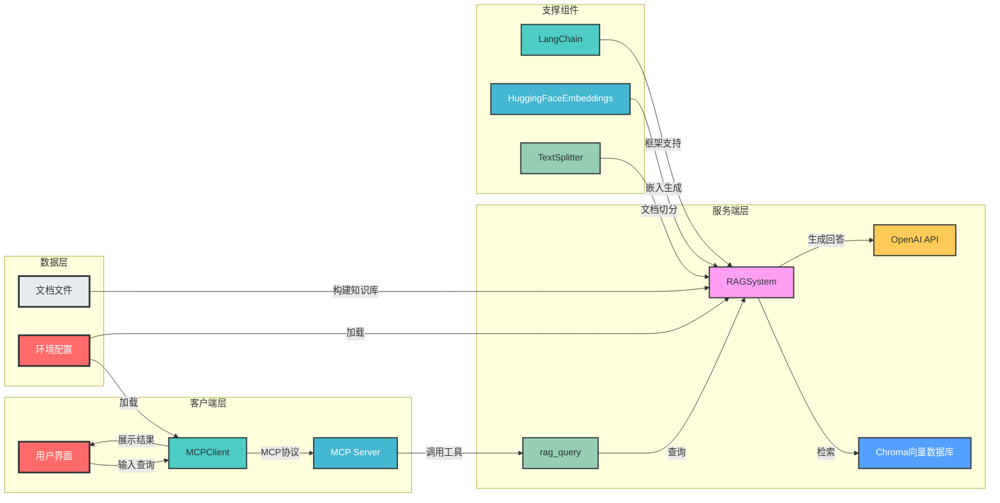

# MCP-RAG 智能问答系统架构分析

## 1. 概述

MCP-RAG 是一个基于向量数据库的智能问答系统，采用客户端-服务器架构，通过 MCP（Model Context Protocol）协议实现通信。系统主要功能包括知识库构建、智能问答和服务化部署，支持对指定文档（如斗破苍穹小说）进行智能检索和问答。

### 1.1 核心技术栈
- **LangChain**: 提供 RAG 应用开发框架
- **Chroma**: 向量数据库，用于存储文档嵌入
- **HuggingFaceEmbeddings**: 提供本地文本嵌入模型
- **OpenAI API**: 兼容的大语言模型接口
- **MCP Protocol**: 客户端-服务器通信协议

### 1.2 系统定位
该系统旨在为特定领域文档提供高效的智能问答服务，支持服务化部署和客户端集成，适用于需要基于私有知识库进行问答的场景。

## 2. 模块分析

### 2.1 RAG 服务端模块 (rag_server.py)

#### 2.1.1 核心功能
- 知识库构建：文档加载、切分、嵌入生成和向量存储
- 智能问答：接收查询、检索相关文档、生成回答
- MCP 服务封装：提供标准化接口供客户端调用

#### 2.1.2 关键组件

**RAGSystem 类**：
- `__init__()`: 初始化配置、LLM、嵌入模型和向量数据库
- `build_knowledge()`: 构建知识库主流程
- `query()`: 执行智能问答流程

**文档处理方法**：
- `_load_documents()`: 支持 PDF 和 TXT 格式文档加载
- `_chunk_documents()`: 使用递归字符切分器切分文档

**MCP 服务**：
- 使用 FastMCP 创建服务端
- 定义 `rag_query()` 工具函数供客户端调用

#### 2.1.3 技术特点
- 支持自定义配置（chunk_size、chunk_overlap、top_k 等）
- 采用 MMR 检索策略提高检索多样性
- 自动构建知识库并持久化存储

### 2.2 RAG 客户端模块 (rag_agent.py)

#### 2.2.1 核心功能
- 连接 MCP 服务端
- 管理对话上下文
- 处理用户查询并调用服务端工具
- 展示查询结果

#### 2.2.2 关键组件

**MCPClient 类**：
- `__init__()`: 初始化客户端配置和 OpenAI 客户端
- `connect_server()`: 连接到服务端脚本
- `process_query()`: 处理用户查询，调用 OpenAI API 和服务端工具
- `chat()`: 聊天模式处理用户输入

#### 2.2.3 技术特点
- 支持异步操作提高性能
- 自动处理服务端工具调用
- 异常处理和资源清理机制

### 2.3 环境配置模块 (.env)

#### 2.3.1 核心配置项
- **API 配置**：BASE_URL、API_KEY
- **模型配置**：MODEL
- **本地模型配置**：EMBED_MODEL、RERANK_MODEL
- **天气 API 配置**：WEATHER_API_KEY、WEATHER_API_URL

#### 2.3.2 配置作用
- 集中管理系统参数
- 支持不同环境部署
- 保护敏感信息

## 3. 交互关系

### 3.1 模块间交互图



### 3.2 核心交互流程
1. **启动流程**：
   - 服务端：加载配置 → 初始化组件 → 构建知识库 → 启动 MCP 服务
   - 客户端：加载配置 → 初始化客户端 → 连接服务端 → 等待用户输入

2. **查询流程**：
   - 用户输入查询 → 客户端接收 → 发送到服务端 → 服务端检索相关文档 → 调用 LLM 生成回答 → 返回结果 → 客户端展示

## 4. 数据流向和控制流程

### 4.1 知识库构建流程



### 4.2 智能问答流程


## 5. 系统架构图



## 6. 总结

### 6.1 系统优势
1. **模块化设计**：客户端-服务器分离，职责明确
2. **灵活配置**：支持多种参数自定义
3. **服务化部署**：通过 MCP 协议支持服务化调用
4. **本地与云服务结合**：本地嵌入模型与云 LLM 结合，平衡性能与成本

### 6.2 应用场景
- 特定领域文档智能问答
- 企业内部知识库查询
- 需要服务化部署的 RAG 应用

### 6.3 改进方向
1. 增加文档格式支持（如 Word、Markdown）
2. 优化检索策略，提高准确性
3. 增加缓存机制，提高响应速度
4. 增强错误处理和日志记录
5. 支持多知识库管理

## 7. 代码优化建议

### 7.1 rag_server.py 优化建议
1. **配置管理改进**：
   ```python
   # 原代码
   config = {
       "persist_dir": "./data/rag_db",
       "collection_name": "rag",
       "chunk_size": 500,
       "chunk_overlap": 50,
       "top_k": 5
   }
   
   # 优化建议
   class Config:
       def __init__(self, **kwargs):
           self.persist_dir = kwargs.get("persist_dir", "./data/rag_db")
           self.collection_name = kwargs.get("collection_name", "rag")
           self.chunk_size = kwargs.get("chunk_size", 500)
           self.chunk_overlap = kwargs.get("chunk_overlap", 50)
           self.top_k = kwargs.get("top_k", 5)
   
   config = Config()
   ```

2. **错误处理增强**：
   ```python
   # 原代码
   def build_knowledge(self, file_paths):
       raw_docs = self._load_documents(file_paths)
       chunks = self._chunk_documents(docs = raw_docs)
       self.vectorstore.add_documents(chunks)
       self.vectorstore.persist()
       print(f"知识库构建完成,文档块数为:{len(chunks)}")
   
   # 优化建议
   def build_knowledge(self, file_paths):
       try:
           raw_docs = self._load_documents(file_paths)
           if not raw_docs:
               raise ValueError("未加载到任何文档")
           
           chunks = self._chunk_documents(docs=raw_docs)
           if not chunks:
               raise ValueError("文档切分失败")
           
           self.vectorstore.add_documents(chunks)
           self.vectorstore.persist()
           print(f"知识库构建完成,文档块数为:{len(chunks)}")
       except Exception as e:
           print(f"知识库构建失败: {str(e)}")
           raise
   ```

### 7.2 rag_agent.py 优化建议
1. **异步上下文管理**：
   ```python
   # 原代码
   async def main():
       server_script = args.server_script
       client = MCPClient()
       try:
           print("开始启动")
           await client.connect_server(server_script)
           await client.chat()
       finally:
           await client.cleanup()
   
   # 优化建议
   class MCPClient:
       # ... 其他代码 ...
       
       async def __aenter__(self):
           await self.init()
           return self
       
       async def __aexit__(self, exc_type, exc_val, exc_tb):
           await self.cleanup()
   
   async def main():
       server_script = args.server_script
       async with MCPClient() as client:
           print("开始启动")
           await client.connect_server(server_script)
           await client.chat()
   ```

2. **配置验证**：
   ```python
   # 原代码
   self.client = OpenAI(
       api_key=os.getenv("API_KEY"),
       base_url=os.getenv("BASE_URL"),
       http_client=httpx.Client(verify=False)
   )
   
   # 优化建议
   def _validate_config(self):
       required_env_vars = ["API_KEY", "BASE_URL", "MODEL"]
       for var in required_env_vars:
           if not os.getenv(var):
               raise ValueError(f"环境变量 {var} 未设置")
   
   def __init__(self):
       self._validate_config()
       self.client = OpenAI(
           api_key=os.getenv("API_KEY"),
           base_url=os.getenv("BASE_URL"),
           http_client=httpx.Client(verify=False)
       )
       # ... 其他代码 ...
   ```

## 8. 运行示例

### 8.1 启动服务端
```bash
python rag_server.py --mode server
```

### 8.2 运行客户端
```bash
python rag_agent.py --server_script rag_server.py
```

### 8.3 测试查询
```bash
python rag_server.py --mode test --query "萧炎的女性朋友有哪些?"
```

---

*文档生成时间：2025-12-19*
*版本：v1.0*