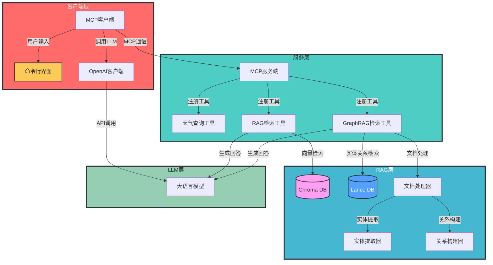

### 系统架构图

```mermaid
graph TD
    subgraph Client_Layer[客户端层]
        Client[MCP客户端] -->|用户输入| UserInterface[命令行界面]
        Client -->|调用LLM| LLMClient[OpenAI客户端]
    end
    
    subgraph Service_Layer[服务层]
        MCP_Server[MCP服务端] -->|注册工具| WeatherTool[天气查询工具]
        MCP_Server -->|注册工具| RAGTool[RAG检索工具]
        MCP_Server -->|注册工具| GraphRAGTool[GraphRAG检索工具]
    end
    
    subgraph RAG_Layer[RAG层]
        RAGTool -->|向量检索| VectorDB[(Chroma DB)]
        GraphRAGTool -->|实体关系检索| GraphDB[(Lance DB)]
        GraphRAGTool -->|文档处理| DocumentProcessor[文档处理器]
        DocumentProcessor -->|实体提取| EntityExtractor[实体提取器]
        DocumentProcessor -->|关系构建| RelationBuilder[关系构建器]
    end
    
    subgraph LLM_Layer[LLM层]
        LLMClient -->|API调用| LLM[大语言模型]
        RAGTool -->|生成回答| LLM
        GraphRAGTool -->|生成回答| LLM
    end
    
    Client -->|MCP通信| MCP_Server
    
    style Client_Layer fill:#FF6B6B,stroke:#2D3436,stroke-width:3px,color:white
    style Service_Layer fill:#4ECDC4,stroke:#2D3436,stroke-width:3px,color:#2D3436
    style RAG_Layer fill:#45B7D1,stroke:#2D3436,stroke-width:3px,color:white
    style LLM_Layer fill:#96CEB4,stroke:#2D3436,stroke-width:3px,color:#2D3436
    style VectorDB fill:#FF9FF3,stroke:#2D3436,stroke-width:2px,color:#2D3436
    style GraphDB fill:#54A0FF,stroke:#2D3436,stroke-width:2px,color:white
    style UserInterface fill:#FECA57,stroke:#2D3436,stroke-width:2px,color:#2D3436
```